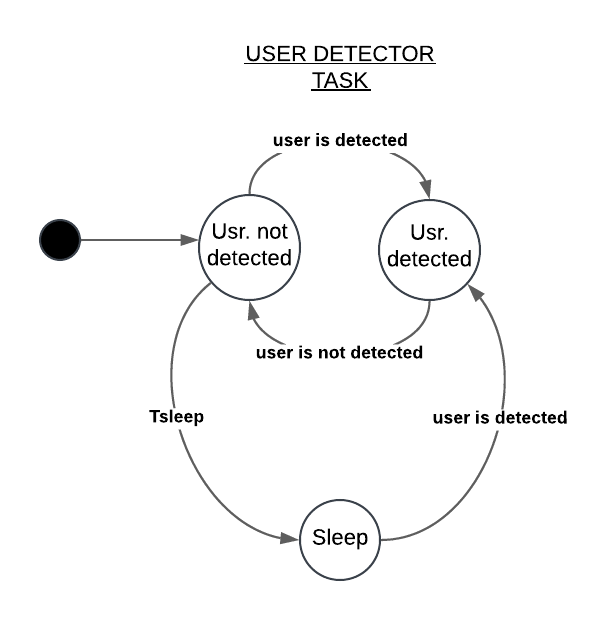
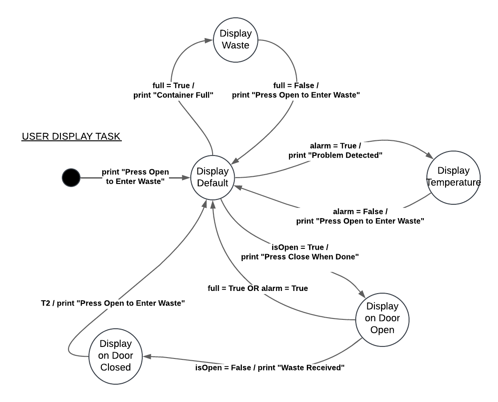
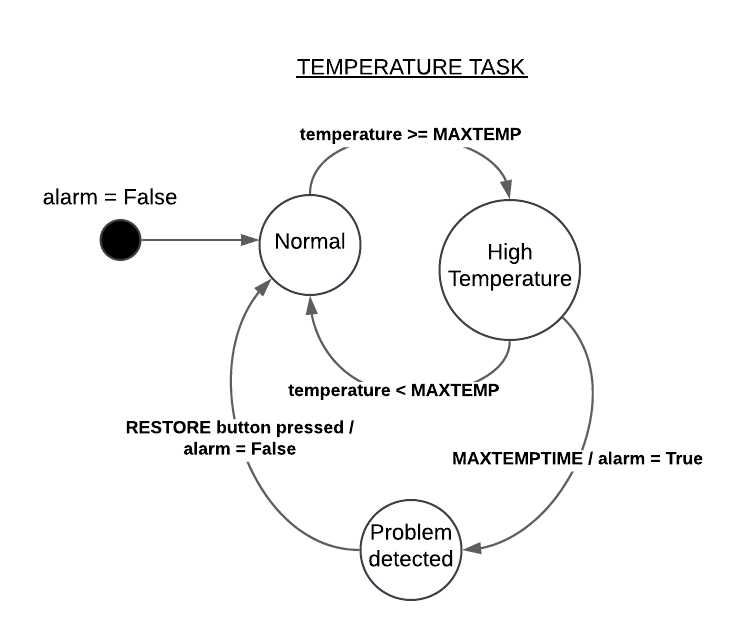
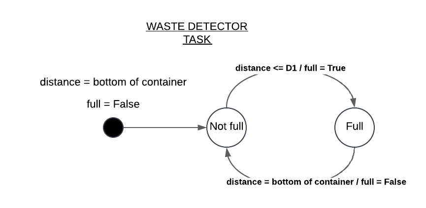
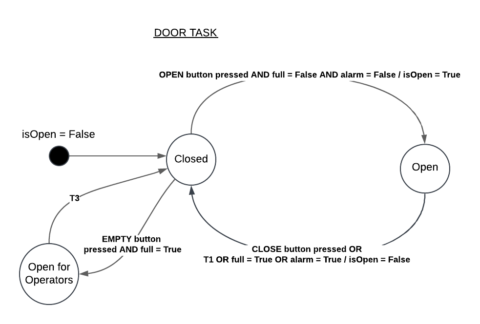
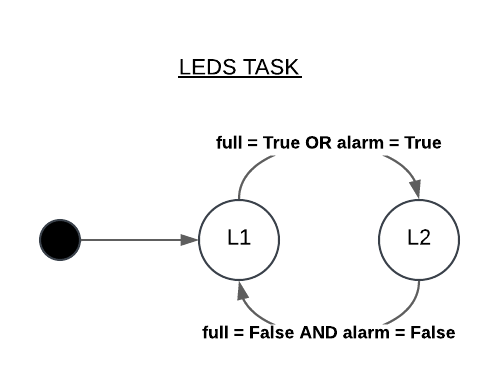
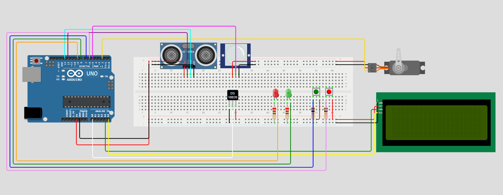

# Relazione del Programma: Bidone Intelligente per Rifiuti Tossici

## Descrizione del Programma

Il programma fornisce un'implementazione di un bidone intelligente per lo smaltimento di rifiuti tossici, simulato con Arduino Uno. Il sistema è dotato di vari sensori e attuatori per monitorare e controllare lo stato del bidone. Inoltre, è stata fornita una GUI per interagire con il bidone.

## Componenti Principali

### Sensori e Attuatori

- **ServoMotor**: Utilizzato per controllare l'apertura e la chiusura del coperchio del bidone.
- **LED**: Indicatori di stato per segnalare condizioni normali o di errore.
- **Button**: Pulsanti per aprire e chiudere manualmente il coperchio del bidone.
- **PIR (Passive Infrared Sensor)**: Sensore di movimento per rilevare la presenza di utenti.
- **Thermistor**: Sensore di temperatura per monitorare la temperatura interna del bidone.
- **Sonar**: Sensore a ultrasuoni per misurare il livello di riempimento del bidone.

### Classi Logiche

- **Door**: Gestisce il movimento del coperchio del bidone.
- **TemperatureDetector**: Monitora la temperatura e rileva condizioni di surriscaldamento.
- **WasteDetector**: Monitora il livello di riempimento del bidone.
- **MsgService**: Gestisce la comunicazione seriale per inviare e ricevere messaggi.

### Task Scheduler

Il programma utilizza un task scheduler per eseguire periodicamente i vari task. Ogni task è responsabile di una specifica funzionalità del sistema:

- **UserDetectorTask**: Rileva la presenza di utenti tramite il sensore PIR.
- **UserDisplayTask**: Aggiorna il display LCD con messaggi di stato.
- **TemperatureTask**: Monitora la temperatura interna del bidone e gestisce le condizioni di allarme.
- **WasteDetectorTask**: Monitora il livello di riempimento del bidone e gestisce le condizioni di allarme.
- **DoorTask**: Gestisce l'apertura e la chiusura del coperchio del bidone.
- **LedsTask**: Gestisce gli indicatori LED per segnalare lo stato del sistema.

## Funzionamento

### UserDetectorTask

### UserDisplayTask

### TemperatureTask

### WasteDetectorTask

### DoorTask

### LedsTask

## Schema della Breadboard

## Comunicazione

Il sistema utilizza la comunicazione seriale per inviare e ricevere messaggi. La classe [`MsgService`](src/arduino/lib/communication/MsgService.h) gestisce la comunicazione seriale, permettendo al sistema di inviare messaggi di stato e ricevere comandi da un'interfaccia utente esterna.

## Conclusione

Il programma per il bidone intelligente per rifiuti tossici è un sistema complesso che integra vari sensori e attuatori per monitorare e controllare lo stato del bidone. Utilizzando un task scheduler, il sistema esegue periodicamente i task necessari per garantire il corretto funzionamento e la sicurezza del bidone. La comunicazione seriale permette l'interazione con un'interfaccia utente esterna, fornendo un controllo completo del sistema.