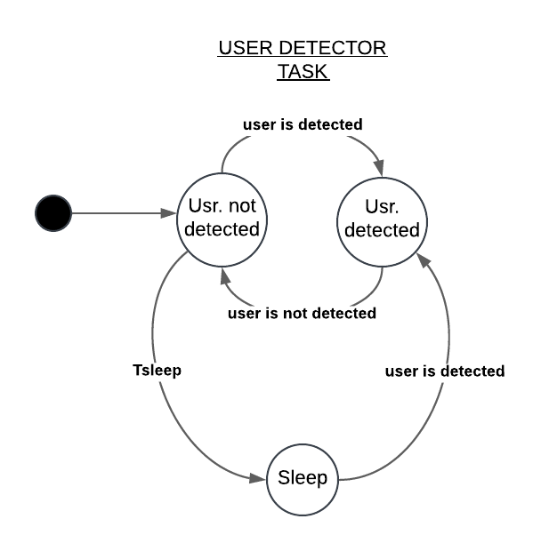
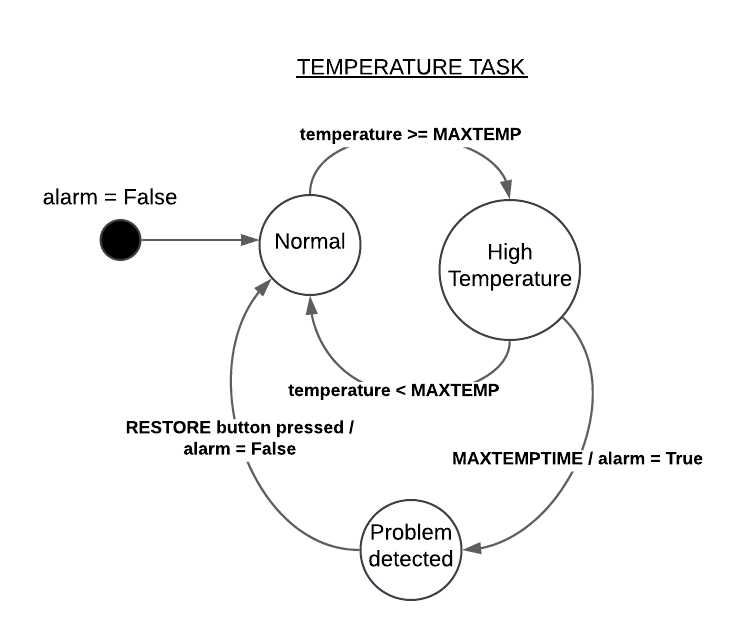
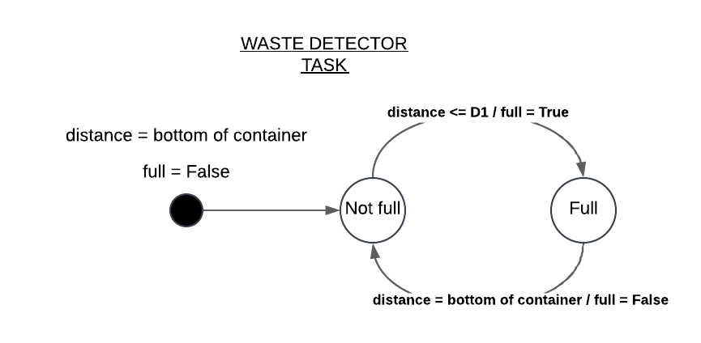
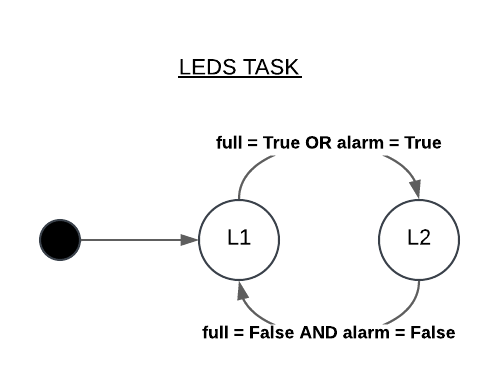
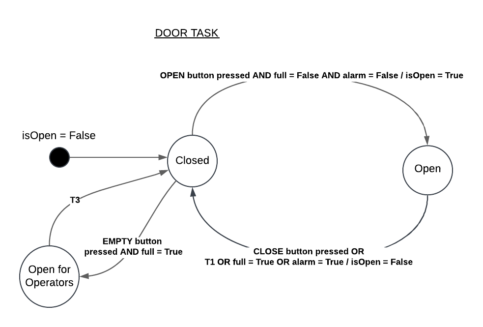
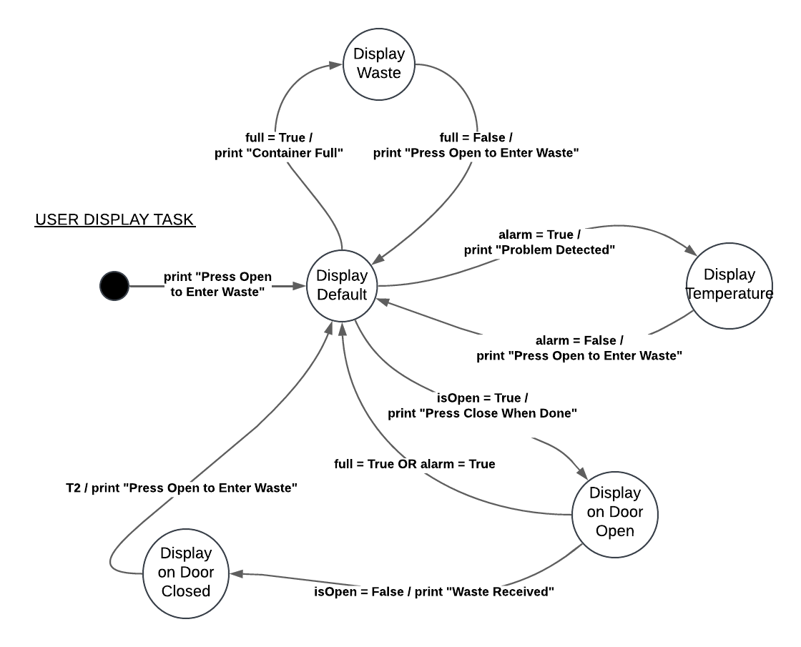
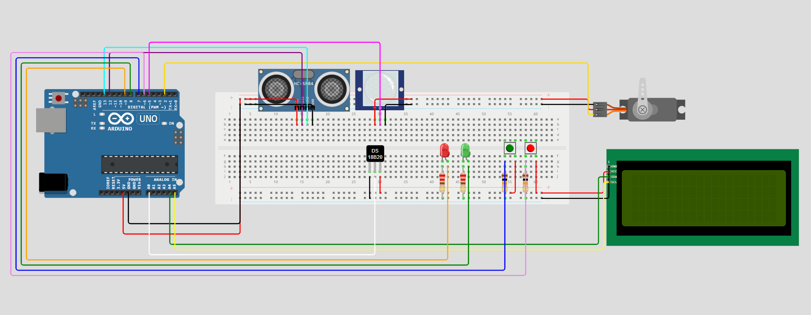

# Report Assignment 02: Smart Waste Disposal System

### Membri del gruppo:
- **Caberletti Sofia** (0001071418)
- **Marrelli Marco** (0001079192)
- **Zanchini Margherita** (0001081989)

## Descrizione del Sistema

Il Smart Waste Disposal Container è un sistema embedded che implementa una gestione intelligente dei rifiuti liquidi pericolosi. Il sistema è composto da vari sensori e attuatori per monitorare e gestire lo stato del bidone. L'utente può interagire con il sistema tramite due bottoni per aprire e chiudere il bidone, mentre agli operatori viene fornita una dashboard di controllo. L'implementazione software è basata su un'architettura task-based, composta quindi da più task sviluppate a partire da Synchronous Finite State Machines, cioè time-triggered FSMs. Queste task vengono poi gestite da uno scheduler.

## Architettura task-based con utilizzo di un Task Scheduler

Il programma utilizza uno `Scheduler` per gestire l'esecuzione periodica degli oggetti `Task`. Il metodo `schedule` dello scheduler viene richiamato ad ogni ciclo del `loop` e periodicamente, secondo un interrupt generato dal timer, controlla se ci sono dei task che possono essere eseguiti. Il controllo viene fatto sull'array `taskList` che contiene tutti i task del sistema e se un task può essere eseguito (quindi il suo specifico periodo è passato) viene richiamato il suo metodo `tick` che contiene il codice del suo comportamento.

## Componenti Principali

### Sensori e Attuatori

- **ServoMotor**: Utilizzato per controllare l'apertura e la chiusura del coperchio del bidone.
- **LED**: Indicatori di stato per segnalare condizioni normali o di errore.
- **Button**: Pulsanti per aprire e chiudere manualmente il coperchio del bidone.
- **PIR (Passive Infrared Sensor)**: Sensore di movimento per rilevare la presenza di utenti.
- **Thermistor**: Sensore di temperatura per monitorare la temperatura dei liquidi tossici all'interno.
- **Sonar**: Sensore a ultrasuoni per misurare il livello di riempimento del bidone.

### Classi Logiche

- *Door*: Gestisce il movimento del coperchio del bidone.
- *TemperatureDetector*: Monitora la temperatura e rileva condizioni di surriscaldamento.
- *WasteDetector*: Monitora il livello di riempimento del bidone.
- *MsgService*: Gestisce la comunicazione seriale per inviare e ricevere messaggi.

## Task Scheduler

Il programma utilizza un task scheduler per eseguire periodicamente i vari task attraverso il metodo `schedule`. I task sono contenuti in un array `taskList` situato all'interno dello scheduler. I task sono delle classi astratte e il loro comportamento è descritto all'interno del metodo `tick`.

Per sviluppare ogni task siamo partiti da diagrammi delle final state machine. Guardiamole più nel dettaglio.

### User Detector Task

Questa task rileva la presenza di utenti tramite il sensore PIR, inoltre si occupa di gestire lo stato di sleep dell'intero sistema. Quando non viene rilevato nessun utente nelle vicinzanze del bidone per un periodo di tempo T1, il sistema entra automaticamente in uno stato di light sleep per risparmiare energia, dal quale può essere risvegliato solo tramite il sensore PIR al quale è stato associato un interrupt. 

### Temperature Task

E' il task che si occupa di monitorare la temperatura del liquido tossico all'interno del bidone tramite il sensore Thermistor. Utilizza la variabile `alarm`, che indica una temperatura critica del liquido, assume valore true solo quando il task è in stato `PROBLEM DETECTED`. La variabile `alarm` può essere riportata a false (e quindi ripristinare lo stato normale del task), quando l'operatore preme il pulsante `RESTORE` sulla GUI.

### Waste Detector Task

Questo task monitora il livello di rimpimento del bidone tramite il sensore Sonar. Utilizza la variabile `full`, che segnala un livello di riempimento troppo alto (impedendo ulteriori riempimenti). La variabile `full` può essere riportata a false (ripristinando il normale comportamento del task) quando l'operatore svuota il bidone.

### Leds Task

Gestisce gli indicatori LED per segnalare lo stato del sistema. Fa uso delle variabili precedentemente citate `alarm` e `full`(senza modificarle, ma sono monitornandone i valori). Se il sistema è in uno stato normale (`L1`) viene acceso solo il LED L1 (tipicamente verde), se invece una o entrambe le variabili assumono il valore true, il task passa a uno stato di "problema" spegnendo L1 e accedendo L2 (tipicamente rosso). Per tornare allo stato normale, entrambe le variabili devono essere false.

### Door Task

Gestisce l'apertura e la chiusura del coperchio del bidone. Lo stato del task dipende dai valori delle variabili `alarm` e `full` e da due bottoni (uno per l'apertura `OPEN button` e uno per la chiusura `CLOSE button`) inoltre utilizza una variabile `isOpen`. Perchè il bidone possa essere aperto dall'utente entrambe le variabili `alarm` e `full` devono essere `false`. Il task non può rimanere nello stato `OPENED` per più di tempo T2. Inoltre, l'operatore può aprire il bidone in modalità "operatore" utilizzando il pulsante `EMPTY` sulla GUI, che consente di svuotare il bidone quando è pieno.

### User Display Task

Gestisce l'output testuale su uno schermo LCD (I2C, nel nostro caso 20x4). I messaggi sono preconfigurati e devono aggiornarsi quando:
- **"Press Open to Enter Waste"**: Messaggio da mostrare di default
- **"Press Close When Done"**: Messaggio da mostrare quando la porta è aperta.
- **"Waste Received"**: Messaggio da mostrare quando la porta viene chiusa (senza presenza di alarms) o da un utente, o automaticamente. Dopo un tempo T2, ritorna al messaggio di default.
- **"Container Full"**: Messaggio da mostrare quando il contenitore supera la soglia d'allarme.
- **"Problem Detected!"**: Messaggio da mostrare quando il termistore ha l'allarme attivo.
All'interno del task vengono considerati anche le tempistiche di stampa su schermo.

## Funzionamento

### UserDetectorTask

### UserDisplayTask

### TemperatureTask

### WasteDetectorTask

### DoorTask

### LedsTask

## Schema della Breadboard

## Comunicazione

Il sistema utilizza la comunicazione seriale per inviare e ricevere messaggi. La classe [`SerialHandler`](../src/arduino/lib/communication/SerialHandler.h) gestisce la comunicazione, permettendo al sistema di inviare messaggi di stato e ricevere comandi da un'interfaccia utente esterna. L'[`interfaccia`](../src/pc/assignment02/src/main/java/assignment02/App.java), scritta in JavaFX, permette di visualizzare graficamente questi dati e di trasmettere azioni di svuotaggio e restoring del sistema tramite pulsanti su schermo.

## Conclusione

Il programma per il bidone intelligente per rifiuti tossici è un sistema complesso che integra vari sensori e attuatori per monitorare e controllare lo stato del bidone. Utilizzando un task scheduler, il sistema esegue periodicamente i task necessari per garantire il corretto funzionamento e la sicurezza del bidone. La comunicazione seriale permette l'interazione con un'interfaccia utente esterna, fornendo un controllo completo del sistema.