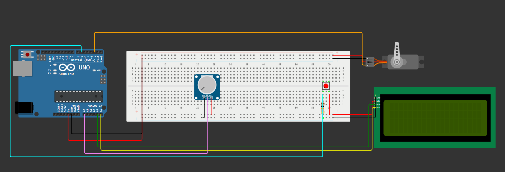
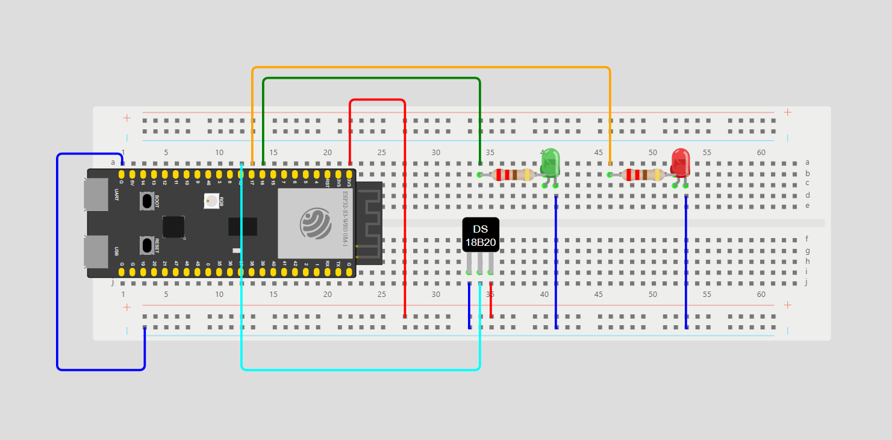
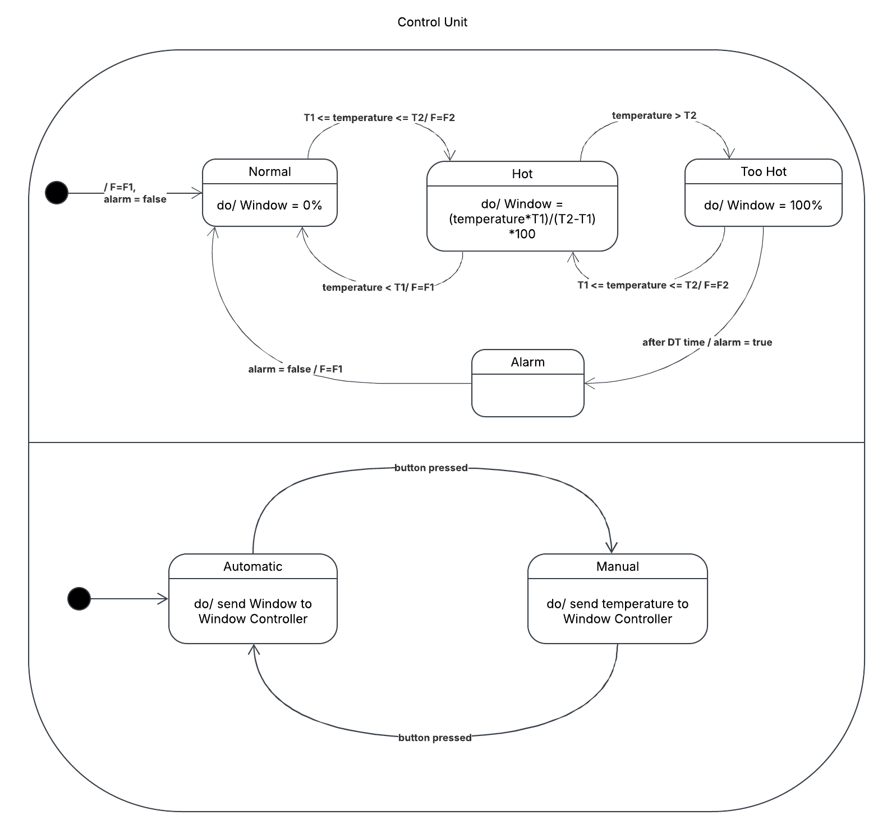
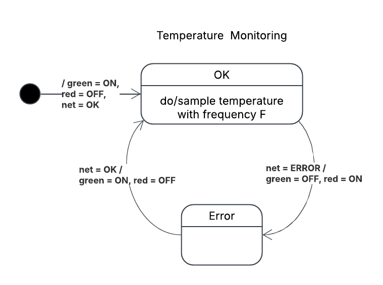
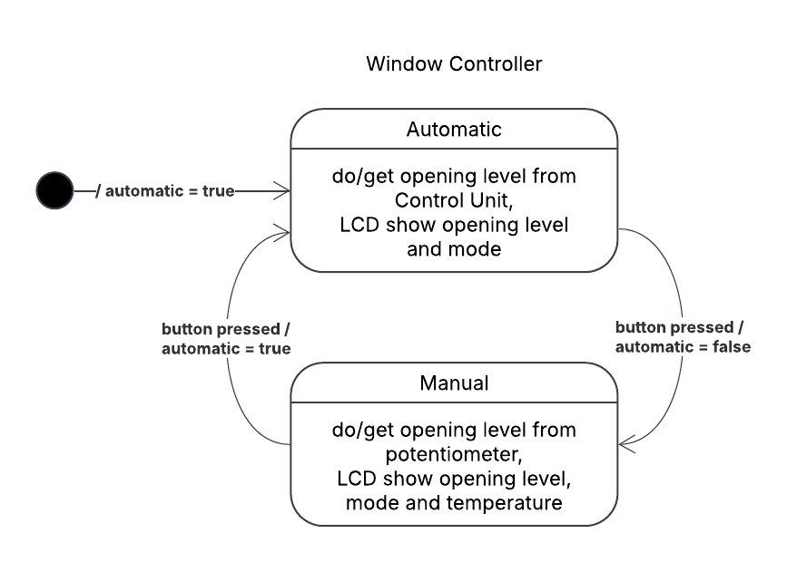
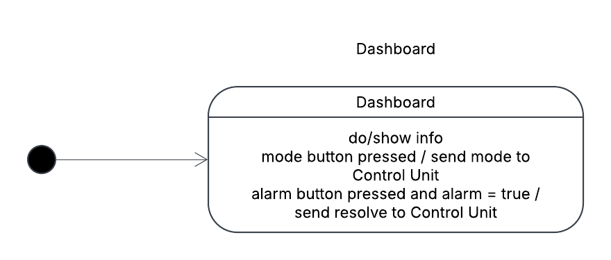

# Assignment 03 - Smart Temperature Monitoring
- Caberletti Sofia 0001071417
- Marrelli Marco 0001079192
- Margherita Zanchini 0001081989

## Descrizione del Sistema
Il sistema è progettato per monitorare la temperatura di un ambiente chiuso e controllare l'apertura della finestra in base alla temperatura rilevata. Il sistema può operare in due modalità: AUTOMATICO e MANUALE. In modalità AUTOMATICO, il sistema decide automaticamente quanto aprire la finestra in base alla temperatura corrente. In modalità MANUALE, l'apertura è controllata manualmente da un operatore. La modalità iniziale all'avvio è AUTOMATICO.

Il sistema di monitoraggio della temperatura è composto da quattro sottosistemi principali: 
- Control Unit: centro di controllo principale del sistema che gestisce la comunicazione con i vari sottosistemi.
- Temperature Monitoring: gestisce l'ESP32 con la rilevazione della temperatura.
- Window Controller: gestisce Arduino Uno e i componenti a lui attaccati. Viene gestita l'apertura della finestra e il passaggio da modalità manuale a automatica.
- Dashboard: mostra le informazioni attuali del sistema e permette di risolvere l'alarm.

#### Schema di Arduino

    

#### Schema dell'ESP32S3

    

## Control Unit Subsystem
Il Control Unit governa e coordina l'intero sistema. Contiene la logica che gestisce tutti i sottosistemi scritta in Java.

    

Questo sottosistema si basa su una FSM sincrona composta da quattro stati principali:
- **NORMAL**: Lo stato iniziale in cui il sistema monitora la temperatura e mantiene la frequenza di campionamento a F1. In questo stato la temperatura è sottocontrollo e quindi la finestra è mantenuta chiusa.
- **HOT**: Quando la temperatura supera la soglia T1, il sistema passa allo stato HOT e aumenta la frequenza di campionamento a F2. L'apertura della finestra è proporzionale all'intervallo tra T1 e T2.
- **TOO_HOT**: Se la temperatura supera la soglia T2, il sistema entra nello stato TOO_HOT. La finestra viene aperta completamente.
- **ALARM**: Se la temperatura rimane sopra T2 per un periodo di tempo DT, il sistema entra nello stato di ALLARME e notifica l'operatore. Si potrà uscire dallo stato ALARM solo una volta che l'operatore avrà agito sulla Dashboard.

Inoltre può lavorare in due modalità diverse:
- **AUTOMATIC**: L'apertura della finestra viene scelta automaticamente dal Control Unit in base alla temperatura. 
- **MANUAL**: L'apertura viene scelta dall'operatore tramite il potenziometro collegato al Window Controller.

Il Control Unit utilizza diversi protocolli per comunicare con gli altri sottosistemi:
- **MQTT**: Utilizzato per la comunicazione con Temperature Monitoring. Il sottosistema di controllo riceve le misurazioni della temperatura e invia la frequenza di campionamento.
- **Seriale**: Utilizzato per la comunicazione con il Window Controller. Il sottosistema di controllo invia il valore di apertura della finestra se si è in modalità AUTO mentre se si è in modalità MANUAL l'apertura viene mandata dal Window Controller. Infine riceve o manda la modalità (AUTO/MANUAL) del sistema.
- **HTTP**: Utilizzato per la comunicazione con la Dashboard. Il sottosistema di controllo invia i dati di monitoraggio della temperatura e riceve i comandi per risolvere gli allarmi o cambiare modalità.

## Temperature Monitoring Subsystem
Questo sottosistema è composto da ESP32-S3, da un led rosso, uno verde e da un thermistor. Il Temperature Monitoring rileva con una frequenza F, decisa dal Control Unit, la temperatura della stanza. Le temperature rilevate vengono poi mandate al Control Unit tramite protocollo MQTT.

    

Il sottosistema è basato su una FSM sincrona composta da due stati:
- **OK**: L'ESP32-S3 è connesso correttamente al Control Unit tramite MQTT e ciò viene indicato dal led verde accesso.
- **ERROR**: Se si verifica un problema di connessione si entra in questo stato e il led rosso viene acceso. 

## Window Controller Subsystem
Questo sottosistema è composto da Arduino UNO, da un servo motore, da un potenziometro, da un bottone e da un LCD. Il Window Controller si occupa dell'apertura e della chiusura fisica della finestra e permette grazie al bottone di cambiare la modalità. LCD mostra alcune informazioni sullo stato attuale del sistema.

    

Il Window Controller è basato su una FSM sincrona composta da due stati:
- **AUTOMATIC**: L'apertura della finestra è decisa dal Control Unit e mostrata dall'LCD insieme alla modalità corrente. Premendo il bottone si passa alla modalità manuale.
- **MANUAL**: L'apertura della finestra è decisa dall'operatore tramite il potenziometro. In questo stato l'LCD mostra anche il valore corrente della temperatura. Premendo il bottone si torna alla modalità automatica.

## Dashboard Subsystem
La Dashboard ha due funzionalità principali: visualizzare lo stato del sistema mostrando alcune informazioni chiave e consentire agli operatori di interagire con il sistema. La Dashboard visualizza un grafico della temperatura considerando le ultime 10 misurazioni, il valore medio/massimo/minimo corrente, lo stato del sistema (NORMAL, HOT, TOO-HOT, ALARM) e il livello di apertura della finestra in percentuale. Inoltre, permette di cambiare la modalità da AUTOMATIC a MANUAL (e viceversa) e di gestire lo stato di ALARM premendo un pulsante per riportare il sistema allo stato NORMAL. La Dashboard è stata implementata usando JavaFX.

    

